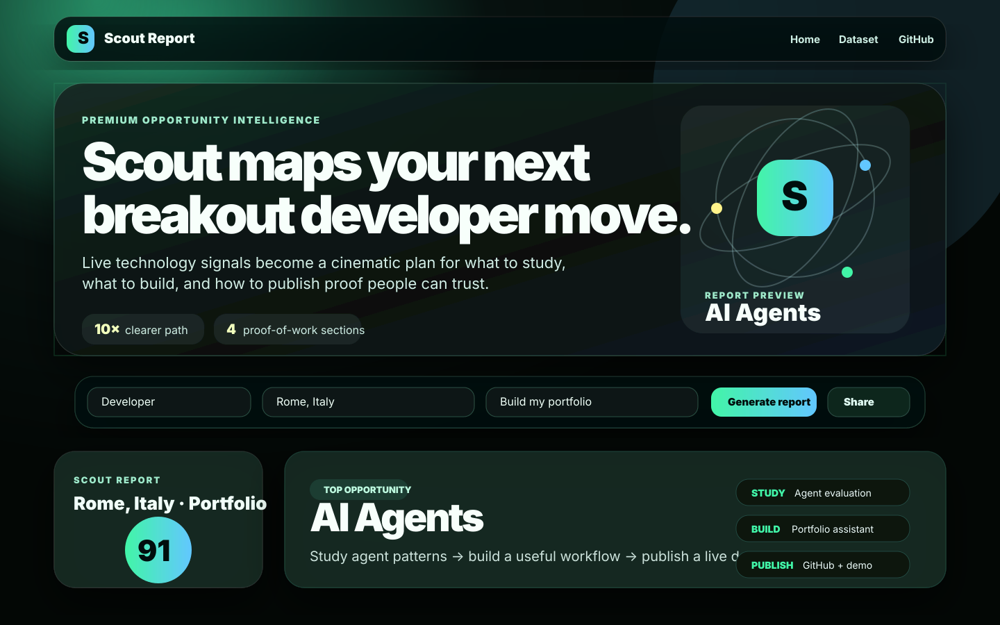
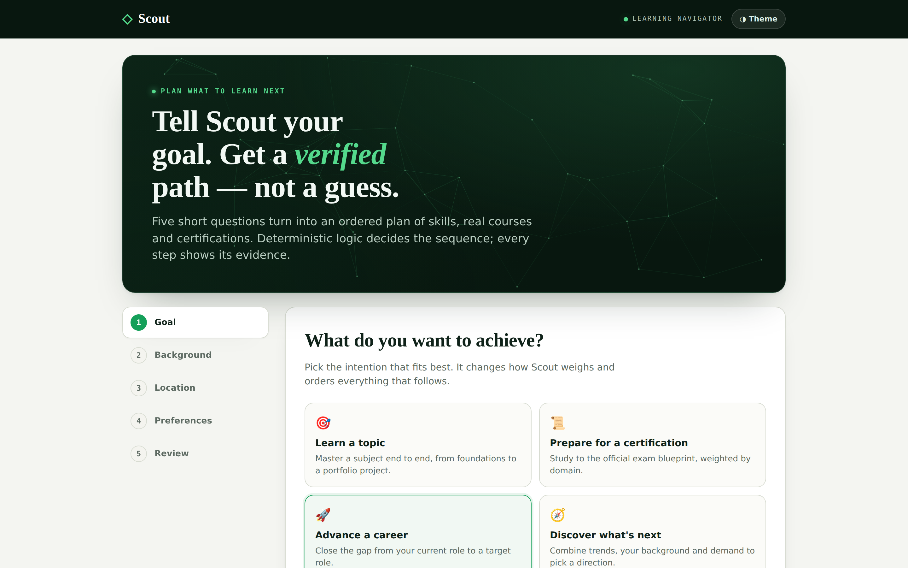
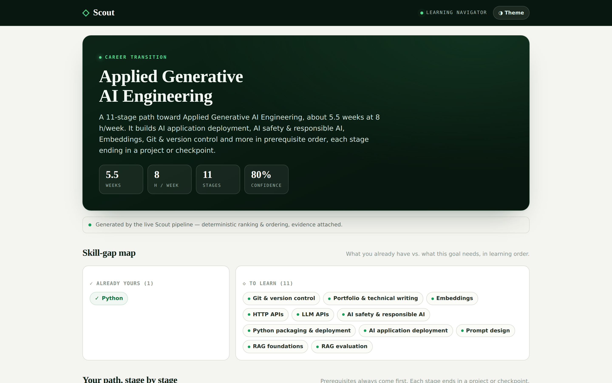
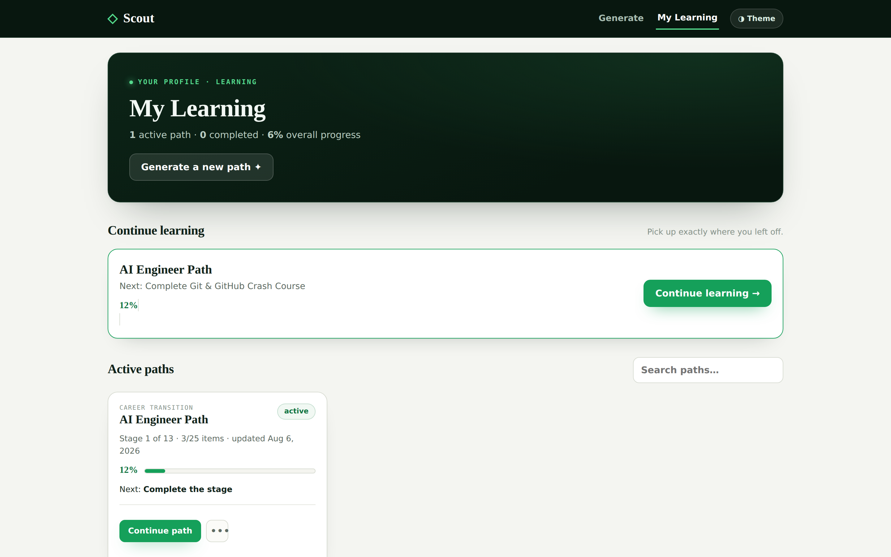
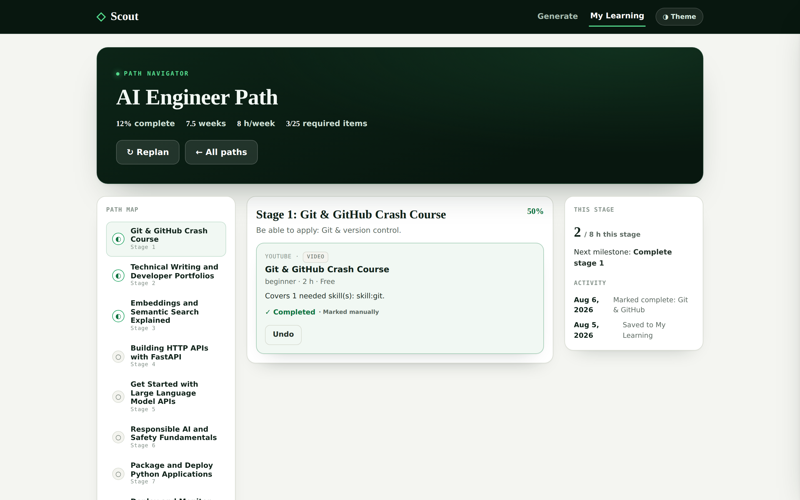
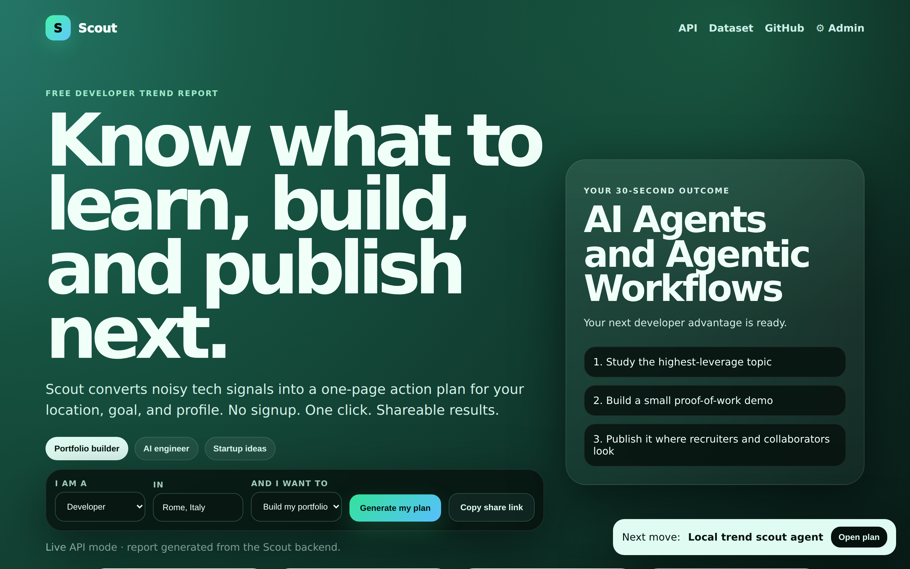
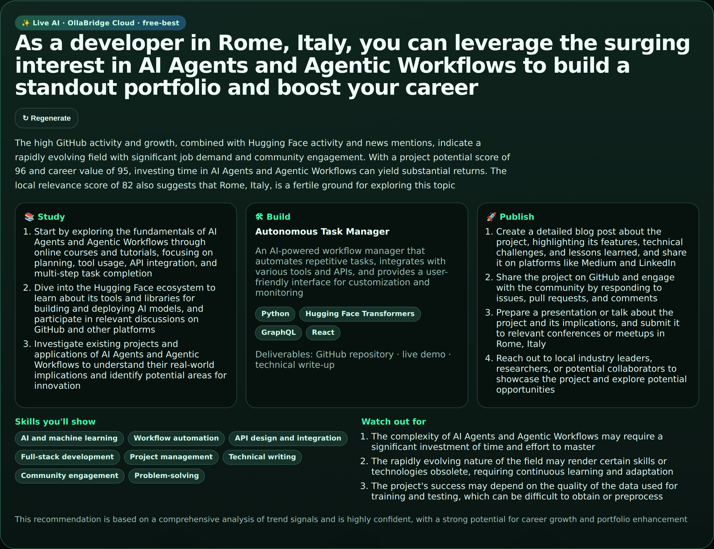
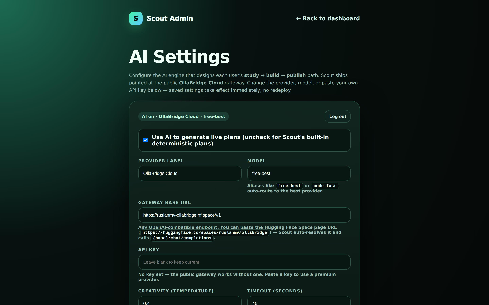

<div align="center">

# 🛰️ Scout — Developer Trend Intelligence

### Know what to learn, build, and publish next.

**Scout turns noisy tech signals into a one-page, AI-designed action plan — tailored to your location, goal, and profile. No signup. One click. Shareable.**

[](https://www.python.org)
[](https://fastapi.tiangolo.com)
[](https://github.com/ruslanmv/ollabridge-cloud)
[](scout_mcp/README.md)
[](LICENSE)

[Learning Navigator](#-learning-navigator--what-to-learn-next) · [Live AI](#live-ai-engine-ollabridge-cloud) · [Quick start](#quick-start) · [MCP server](scout_mcp/README.md) · [API](#core-api-endpoints) · [Docs](docs/)

**Created by [Ruslan Magana Vsevolodovna](https://ruslanmv.com)** — part of the **Agent-Matrix** ecosystem.

</div>



> **One question, answered with evidence:** given your location and goals, what should you **study, build, and publish** right now?

Scout blends real signals — GitHub activity, Hugging Face momentum, news, and job demand — with a **live AI engine** that designs a concrete **study → build → publish** path. Not a hardcoded template: a real plan, grounded in today's data. It runs as an API, a one-click dashboard, and an **[MCP server](scout_mcp/README.md)** any LLM can call to brainstorm what to build next.

And when the question is *what should I learn* — a topic, a certification, or a career move — the **[Learning Navigator](#-learning-navigator--what-to-learn-next)** turns your goal into a verified, ordered path of skills, real courses, and certifications. A deterministic pipeline decides the sequence; AI only narrates it; every step shows its evidence.

## Screenshots

### 🎓 Learning Navigator — goal → verified path

| Five-step wizard | Generated plan with evidence |
| :---: | :---: |
| [](docs/assets/screenshots/learn-wizard.png) | [](docs/assets/screenshots/learn-plan.png) |

Try it live in the app at **`/scout/learn/`**. Each stage explains *why it was
selected* — reasons, warnings, access type, time, level, evidence confidence and
last-verified date — with a free or cheaper alternative, a portfolio project, and
a readiness checkpoint. Prices Scout can't verify read **“Verify on provider.”**

### 🎒 My Learning portal — follow &amp; track your paths

| Dashboard (all your paths) | Path navigator (map · stage · progress) |
| :---: | :---: |
| [](docs/assets/screenshots/portal-dashboard.png) | [](docs/assets/screenshots/portal-navigator.png) |

Save any generated path to **`/scout/my-learning/`** and follow it: a path map
with per-stage status, course cards you can open or mark complete, a details
drawer, deterministic progress, and real replanning that keeps completed work.
Persisted in your browser (localStorage) — no account needed.
**Reference:** [docs/MY_LEARNING_PORTAL.md](docs/MY_LEARNING_PORTAL.md).

### 🛰️ Trend intelligence dashboard

| Scout Report (study → build → publish) | ✨ Live AI plan (grounded in real signals) | 🔐 Admin settings (configure the AI) |
| :---: | :---: | :---: |
| [](docs/assets/screenshots/hero.png) | [](docs/assets/screenshots/ai-plan.png) | [](docs/assets/screenshots/admin.png) |

> Screenshots are captured from the running app with `scripts/shoot.py`
> (Playwright Chromium). To refresh them, start the app (`make serve`) and run
> `python scripts/shoot.py --admin-key "$SCOUT_ADMIN_KEY"` — see
> [Regenerating screenshots](#regenerating-screenshots). The script now also
> drives the Learning Navigator wizard to a generated plan.

Run it locally in one line:

```bash
uvicorn app.main:app --reload   # then open http://127.0.0.1:8000/dashboard
```

## What the frontend consumes

The dashboard is designed to work from one bootstrap endpoint:

```text
GET /api/v1/ui/bootstrap?country=Italy&city=Rome&goal=build_portfolio&profile=developer
```

That returns everything needed for the first screen:

- personalized Scout report,
- local topics,
- global topics,
- project blueprints,
- visibility plan,
- source/dataset URLs,
- UI options.

## Core API endpoints

```text
GET  /api/v1/health
GET  /api/v1/health/sources
GET  /api/v1/health/sources/summary
GET  /api/v1/ui/bootstrap
GET  /api/v1/options
GET  /api/v1/report
POST /api/v1/report
GET  /api/v1/recommendations
GET  /api/v1/trends/global
GET  /api/v1/trends/location
GET  /api/v1/topics
GET  /api/v1/topics/{topic_id}
GET  /api/v1/topics/{topic_id}/deep-dive
GET  /api/v1/topics/{topic_id}/study-plan
GET  /api/v1/topics/{topic_id}/project-blueprints
GET  /api/v1/topics/{topic_id}/visibility-plan
GET  /api/v1/topics/{topic_id}/next-move
GET  /api/v1/matrix/opportunities
GET  /api/v1/batches/latest
POST /api/v1/batches/generate
GET  /api/v1/datasets/latest
GET  /api/v1/datasets/index
GET  /api/v1/datasets/snapshots/{day}
GET  /api/v1/search?q=agents
GET  /api/v1/locations
GET  /api/v1/sources/health
GET  /api/v1/models/status
GET  /api/v1/ai/status
POST /api/v1/ai/plan
POST /api/v1/learning/goals/resolve
POST /api/v1/learning/resources/search
POST /api/v1/learning/skill-gap
POST /api/v1/learning/paths
GET  /api/v1/learning/paths/{path_id}
POST /api/v1/learning/paths/{path_id}/replan
PATCH /api/v1/learning/paths/{path_id}/progress
GET  /api/v1/skills/search
GET  /api/v1/skills/graph
GET  /api/v1/occupations/search
GET  /api/v1/certifications/search
GET  /api/v1/providers/health
GET  /api/v1/admin/enabled
GET  /api/v1/admin/settings      (admin)
POST /api/v1/admin/settings      (admin)
POST /api/v1/admin/test          (admin)
POST /api/v1/admin/reset         (admin)
```

## 🎓 Learning Navigator — what to learn next

Beyond *what to build*, Scout can plan *what to learn*: a verified, ordered path
of skills, courses, and certifications toward a topic, a certification, or a
career move. The path is produced by a **deterministic pipeline** (resolve goal →
skill gap → retrieve resources → rank → weighted set-cover optimizer), and AI
only narrates the result — so it stays reliable and evidence-backed even with AI
and live search switched off.

Four intentions drive it:

| Intention | Example | What Scout does |
| --- | --- | --- |
| **Learn a topic** | *"I want to learn AI"* | Refines it into a complete target (foundations → RAG → deployment → portfolio). |
| **Prepare a certification** | *"AWS Solutions Architect Associate"* | Maps the official exam domains to skills and schedules study by exam weighting. |
| **Advance a career** | *"Python dev → AI engineer"* | Computes the skill gap vs. the target role and orders the fill. |
| **Discover what's next** | *"Backend dev — what now?"* | Combines trends, your background and local demand. |

A five-step **wizard + plan view** lives at [`/scout/learn/`](scout/learn/) — a
single self-contained page skinned to Scout's design system, with a skill-gap
map, a numbered stage timeline, and evidence on every card. It calls the live API
and falls back to deterministic demo data offline.

Generate a path from the API:

```bash
curl -X POST http://127.0.0.1:8000/api/v1/learning/paths \
  -H 'Content-Type: application/json' \
  -d '{"request":{"intent":"advance_career","query":"become an AI engineer",
        "target_role":"AI Engineer","current_skills":[{"name":"Python","level":"intermediate"}],
        "country":"Italy","city":"Rome","hours_per_week":8,"budget":{"maximum":100,"currency":"EUR"}}}'
```

Nine new MCP tools (`resolve_learning_goal`, `generate_learning_path`,
`evaluate_skill_gap`, `find_certifications`, …) expose the same pipeline to any
LLM client. **Full reference:** [docs/LEARNING_NAVIGATOR.md](docs/LEARNING_NAVIGATOR.md).

## Daily generation workflow

The daily workflow populates frontend-ready datasets and batch reports:

```bash
python scripts/collect_all.py
python scripts/validate_dataset.py
python scripts/export_for_github_pages.py
```

Outputs:

```text
datasets/latest.json
datasets/global/latest.json
datasets/batches/latest.json
datasets/snapshots/YYYY-MM-DD.json
datasets/topics/<topic>/latest.json
datasets/topics/<topic>/evidence.json
datasets/topics/<topic>/deep-dive.json
public/scout/
```

GitHub Actions runs this daily through `.github/workflows/daily_trends.yml`.

## Live AI engine (OllaBridge Cloud)

Scout uses a real AI to design each user's **study → build → publish** path. When
you open a report, the dashboard calls `POST /api/v1/ai/plan`, which sends the
top topic plus its **real collected signals** (GitHub, Hugging Face, news, jobs)
to an OpenAI-compatible gateway and gets back a concrete, personalized plan —
not a hardcoded template.

The default gateway is the public **[OllaBridge Cloud](https://github.com/ruslanmv/ollabridge-cloud)**
Space — <https://huggingface.co/spaces/ruslanmv/ollabridge> — which works out of
the box with no API key:

```text
SCOUT_AI_BASE_URL = https://ruslanmv-ollabridge.hf.space/v1
SCOUT_AI_MODEL    = free-best        # or free-fast, qwen2.5:1.5b, fable-5, claude-best, gpt-best
```

The value above is the Space's **direct API endpoint** (the `*.hf.space`
subdomain is what serves `/v1/chat/completions`). You can also set
`SCOUT_AI_BASE_URL` to the Space *page* URL
(`https://huggingface.co/spaces/ruslanmv/ollabridge`) — Scout auto-resolves it
to the endpoint.

Scout is **fail-safe**: if AI is turned off, unconfigured, or the gateway is
unreachable, every plan falls back to the deterministic TF/cosine +
signal-weighted templates, so the API and daily dataset never break. The `source`
field on each plan (`ollabridge-cloud` or `deterministic`) tells you which engine
produced it. The daily public dataset stays deterministic, stable, and auditable;
AI only powers the live, on-demand plan.

### Admin settings (admin only)

Operators can configure the AI engine at runtime from an admin-only page:

```text
http://127.0.0.1:8000/dashboard/admin.html
```

Set the gate first (any secret of your choice), then unlock the page with it:

```bash
export SCOUT_ADMIN_KEY="choose-a-strong-secret"
```

From there an admin can switch the provider/model, paste an API key (stored
server-side, never echoed back to the browser), toggle AI on/off, and run a live
**Test connection**. All settings default from environment variables
(`SCOUT_AI_*`) and runtime overrides are persisted to `runtime/settings.json`
(gitignored). If `SCOUT_ADMIN_KEY` is unset, the admin area stays locked — the
safe default for public deployments.

Other optional model hooks remain available: semantic reranking with
`sentence-transformers` (`SCOUT_USE_SENTENCE_TRANSFORMERS=1`).

**Full reference:** [docs/AI_AND_ADMIN.md](docs/AI_AND_ADMIN.md) — env vars,
endpoints, plan shape, URL auto-resolution, and security notes.

## MCP server — brainstorm what to build

Scout ships as a **Model Context Protocol** server so any LLM (Claude Desktop, or
any MCP client) can call it to brainstorm hot technical trends and the next
high-leverage project — grounded in real signals, not guesses.

```bash
pip install mcp        # the official MCP SDK
python -m scout_mcp    # stdio server (or: python -m scout_mcp --http)
```

Connect it in Claude Desktop's `claude_desktop_config.json`:

```json
{
  "mcpServers": {
    "scout": { "command": "python", "args": ["-m", "scout_mcp"], "cwd": "/absolute/path/to/scout" }
  }
}
```

Then ask: *"Use Scout to brainstorm what an AI engineer in San Francisco should
build this month."* Tools: `list_hot_trends`, `recommend_what_to_build`,
`brainstorm_project_ideas`, `topic_deep_dive`, `find_build_opportunities`,
`search_trends`, `generate_action_plan`. Full guide: [scout_mcp/README.md](scout_mcp/README.md).

## Quick start

The fastest path uses the `Makefile` — it creates a virtualenv, installs
dependencies, and generates the first dataset snapshot:

```bash
make install   # venv + deps + first snapshot
make serve     # run the app on http://127.0.0.1:8000
```

Or set it up by hand:

```bash
python -m venv .venv
source .venv/bin/activate
pip install -r requirements.txt
python scripts/generate_snapshot.py
uvicorn app.main:app --reload
```

Open:

```text
http://127.0.0.1:8000/docs
http://127.0.0.1:8000/dashboard
```

Run tests:

```bash
make test      # or: pytest
```

### Regenerating screenshots

The README images live in `docs/assets/screenshots/` and are captured from the
running app with [`scripts/shoot.py`](scripts/shoot.py) (Playwright Chromium).
Playwright is a transient, sandbox-only dependency — install it just for the
capture and remove it afterwards:

```bash
python -m pip install playwright
python -m playwright install chromium   # skip in sandboxes that pre-install it

# 1. Start the app with an admin key so the admin page can be unlocked.
export SCOUT_ADMIN_KEY="choose-a-secret"
make serve &

# 2. Capture the dashboard (hero/report/ai-plan/admin) and the Learning
#    Navigator (learn-wizard/learn-review/learn-plan/learn-plan-full).
python scripts/shoot.py \
  --base-url http://127.0.0.1:8000 \
  --out docs/assets/screenshots \
  --admin-key "$SCOUT_ADMIN_KEY"

# 3. (optional) Drop the transient dependency.
python -m pip uninstall -y playwright
```

Screenshots default to a 1440×900 viewport at 2× device scale (a crisp
2880×1800 output) in dark mode. Pass `--light` for light-mode captures. The
Learning Navigator shots are always captured light (it belongs to the light
Scout site) and are driven to a generated plan via the page's `window.__scout`
automation hook. In sandboxes that pre-install Chromium at a different build than
the pip Playwright expects, pass `--executable-path` to the bundled binary
instead of running `playwright install`.

## Repository role

Scout is the developer-facing form of **Matrix Scout**, the trend-intelligence layer for Agent-Matrix.

It converts public technology signals into:

- recommended topics,
- developer study paths,
- verified learning paths (skills → courses → certifications),
- portfolio project ideas,
- visibility/publishing plans,
- Agent-Matrix opportunities,
- MCP tools,
- auditable trend datasets.

## Attribution

This repository includes an adapted design inspired by:

- `ashkulz/committers.top` for GitHub location-based contributor discovery.
- `news-and-trends` style scheduled RSS/data/static publishing workflows.

Scout does not claim ownership of those upstream designs. See `NOTICE.md` and `docs/ARCHITECTURE.md`.

## Contribute & credits

Scout is built and maintained by **[Ruslan Magana Vsevolodovna](https://ruslanmv.com)** as the trend-intelligence layer of the **Agent-Matrix** ecosystem.

If Scout helped you decide what to build next, please **⭐ star the repo** and consider contributing — new data sources, topics, fixes, and ideas are all welcome. More projects at **[ruslanmv.com](https://ruslanmv.com)** · **[github.com/ruslanmv](https://github.com/ruslanmv)**.
