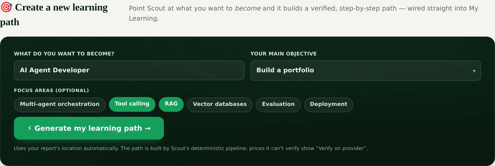

<div align="center">

# 🛰️ Scout

### Developer Trend Intelligence & Learning Navigator

**Know what to learn, build, and publish next — grounded in real signals, explained by AI, and reliable by design.**

[](https://www.python.org)
[](https://fastapi.tiangolo.com)
[](https://github.com/ruslanmv/ollabridge-cloud)
[](scout_mcp/README.md)
[](tests/)
[](LICENSE)

**[Live demo](https://ruslanmv.com/scout/scout/)** · [Learning Navigator](#-learning-navigator--what-to-learn) · [My Learning](#-my-learning--follow--track) · [Quick start](#-quick-start) · [API](#-api-reference) · [MCP](#-mcp-server) · [Docs](#-documentation)

Created by **[Ruslan Magana Vsevolodovna](https://ruslanmv.com)** — part of the **Agent-Matrix** ecosystem.

</div>


> **One question, answered with evidence:** given your location, goals, and current skills — what should you **study, build, and publish** right now, and exactly **how**?

Scout turns noisy technology signals — GitHub activity, Hugging Face momentum, news, and job demand — into a personalized, one‑page action plan, and then into a **verified, ordered learning path** of skills, real courses, and certifications. Its defining principle: **deterministic logic decides what matters and in what order; AI only explains and personalizes it.** That keeps every recommendation auditable, evidence‑backed, and reliable — even with AI switched off.

---

## ✨ At a glance

| | Capability | Where |
| :--: | --- | --- |
| 🔭 | **Discover** — geolocated trend intelligence with an opportunity score, local radar, and global pulse | `/scout/`, `/api/v1/trends/*` |
| 🧭 | **Plan** — a verified learning path (topic · certification · career) built by a deterministic pipeline | [Learning Navigator](#-learning-navigator--what-to-learn) · `/scout/learn/` |
| 🎒 | **Track** — follow a path stage‑by‑stage, mark progress, replan — saved in your browser | [My Learning](#-my-learning--follow--track) · `/scout/my-learning/` |
| 🩺 | **Trust** — a daily monitor that checks every data source and course URL is reachable | [Source health](#-source--api-health) · `/api/v1/health/sources` |
| 🔌 | **Integrate** — a Model Context Protocol server any LLM can call | [MCP](#-mcp-server) · `python -m scout_mcp` |

Run it locally in one line:

```bash
uvicorn app.main:app --reload   # → http://127.0.0.1:8000/docs · /dashboard · /scout
```

---

<!-- SCOUT:TRENDS:START -->
<!-- This section is regenerated every day by scripts/update_readme.py from the latest dataset. Do not edit by hand — changes here are overwritten. -->
## 📈 Trending now — top skills & places

> Auto-generated from Scout's latest signals · **updated 2026-08-28** · 6 tracked topics. Demand blends job postings, career value, growth, and ecosystem fit — [how it works](docs/DATA_SOURCES.md).

### 🔥 Top skills to learn right now

| # | Skill | Demand | Driven by |
| :--: | --- | :--- | --- |
| 1 | **Python** | `█████████░` 92 | AI Agents and Agentic Workflows +4 more |
| 2 | **FastAPI** | `█████████░` 92 | AI Agents and Agentic Workflows +1 more |
| 3 | **Docker** | `█████████░` 92 | AI Agents and Agentic Workflows +1 more |
| 4 | **LangGraph** | `█████████░` 92 | AI Agents and Agentic Workflows |
| 5 | **MCP** | `█████████░` 92 | AI Agents and Agentic Workflows |
| 6 | **RAG** | `█████████░` 92 | AI Agents and Agentic Workflows |
| 7 | **Vector databases** | `█████████░` 90 | Retrieval-Augmented Generation |
| 8 | **Embeddings** | `█████████░` 90 | Retrieval-Augmented Generation |

### 🌐 What's hot by place

| Place | Leading topics |
| --- | --- |
| 🌍 Worldwide | AI Agents and Agentic Workflows · Retrieval-Augmented Generation · Cybersecurity Automation |
| 🇺🇸 San Francisco | AI Agents and Agentic Workflows · LLM and Agent Evaluation · Cloud-Native AI Applications |
| 🇮🇳 Bengaluru | Cloud-Native AI Applications · AI Agents and Agentic Workflows · Retrieval-Augmented Generation |
| 🇮🇹 Milan | Cloud-Native AI Applications · AI Agents and Agentic Workflows · Retrieval-Augmented Generation |
| 🇮🇹 Rome | AI Governance and Policy Automation · Retrieval-Augmented Generation · AI Agents and Agentic Workflows |

> 🧭 Turn any of these into a verified, ordered learning path in the **[Learning Navigator](https://ruslanmv.com/scout/scout/learn/)**.
<!-- SCOUT:TRENDS:END -->

---

## 🎯 From report to a path — in one click

Every Scout report ends with a **“what do you want to become?”** generator. Pick a target role and objective, and Scout builds a verified path with its real pipeline and hands you off to **My Learning** — no retyping, and it works even on the static site (deterministic demo fallback).

[](docs/assets/screenshots/report-become.png)

---

## 🧭 Learning Navigator — *what to learn*

A five‑step wizard turns a goal into a verified, ordered path of skills, real courses, and certifications. A **deterministic pipeline** (resolve goal → skill gap → retrieve resources → rank → weighted set‑cover optimizer) decides the sequence; **AI only narrates it**; every card shows its evidence.

| Five‑step wizard | Generated plan with evidence |
| :---: | :---: |
| [](docs/assets/screenshots/learn-wizard.png) | [](docs/assets/screenshots/learn-plan.png) |

Four intentions drive it:

| Intention | Example | What Scout does |
| --- | --- | --- |
| **Learn a topic** | *“I want to learn AI”* | Refines it into a complete target (foundations → RAG → deployment → portfolio). |
| **Prepare a certification** | *“AWS Solutions Architect Associate”* | Maps the official exam domains to skills; builds a typed prep‑track (training → build → docs → exam guide → practice → projects → register). |
| **Advance a career** | *“Python dev → AI engineer”* | Computes the skill gap vs. the target role and orders the fill. |
| **Discover what’s next** | *“Backend dev — what now?”* | Combines trends, your background, and local demand. |

Each stage explains *why it was selected* — reasons, warnings, access type, time, level, evidence confidence, and last‑verified date — with a free/cheaper alternative, a portfolio project, and a readiness checkpoint. Prices Scout can’t verify read **“Verify on provider.”**

```bash
curl -X POST http://127.0.0.1:8000/api/v1/learning/paths \
  -H 'Content-Type: application/json' \
  -d '{"request":{"intent":"advance_career","query":"become an AI engineer",
        "target_role":"AI Engineer","current_skills":[{"name":"Python","level":"intermediate"}],
        "country":"Italy","city":"Rome","hours_per_week":8,"budget":{"maximum":100,"currency":"EUR"}}}'
```

**Reference:** [docs/LEARNING_NAVIGATOR.md](docs/LEARNING_NAVIGATOR.md)

---

## 🎒 My Learning — *follow & track*

Save any generated path and follow it: a **path map** with per‑stage status, course cards you can open or mark complete, a details drawer, deterministic progress, real replanning that keeps completed work, and full **rename / pause / archive / delete** control. Persisted in your browser (localStorage) — no account needed.

| Dashboard (all your paths) | Path navigator (map · stage · progress) |
| :---: | :---: |
| [](docs/assets/screenshots/portal-dashboard.png) | [](docs/assets/screenshots/portal-navigator.png) |

Opening a provider records a course as *started* but **never** as complete; manual completion is recorded as self‑reported (never provider‑verified). Progress is *completed required items ÷ total required items* — understandable and deterministic.

**Reference:** [docs/MY_LEARNING_PORTAL.md](docs/MY_LEARNING_PORTAL.md)

---

## 🔭 Trend intelligence dashboard

The original Scout: a personalized **study → build → publish** report with an opportunity score, local radar, global pulse, portfolio project ideas, and a live AI plan.

| Scout Report | ✨ Live AI plan | 🔐 Admin settings |
| :---: | :---: | :---: |
| [](docs/assets/screenshots/hero.png) | [](docs/assets/screenshots/ai-plan.png) | [](docs/assets/screenshots/admin.png) |

The dashboard hydrates from a single bootstrap call:

```text
GET /api/v1/ui/bootstrap?country=Italy&city=Rome&goal=build_portfolio&profile=developer
```

---

## 🩺 Source & API health

Recommendations are only as trustworthy as their sources. A **daily monitor** probes everything Scout depends on — GitHub, Hugging Face, the AI gateway, course providers (Microsoft Learn, Open edX, YouTube), search providers, and **every recommended course URL and certification blueprint** — and commits a timestamped snapshot. A `404` on a course URL is flagged *down* (the resource is gone); missing optional keys are *skipped*, not failed.

```text
GET /api/v1/health/sources            # cached daily snapshot (?live=true probes now)
GET /api/v1/health/sources/summary    # overall + counts + "needs attention"
```

**Reference:** [docs/SOURCE_HEALTH.md](docs/SOURCE_HEALTH.md)

---

## 🚀 Quick start

The fastest path uses the `Makefile` (creates a venv, installs deps, generates the first dataset snapshot):

```bash
make install   # venv + deps + first snapshot
make serve     # → http://127.0.0.1:8000
make test      # run the suite (or: pytest)
```

Or by hand:

```bash
python -m venv .venv && source .venv/bin/activate
pip install -r requirements.txt
python scripts/generate_snapshot.py
uvicorn app.main:app --reload
```

Then open:

```text
http://127.0.0.1:8000/docs        # OpenAPI
http://127.0.0.1:8000/dashboard   # trend dashboard
http://127.0.0.1:8000/scout       # multi-page product (report · learn · my-learning)
```

---

## 🤖 Live AI engine (OllaBridge Cloud)

Scout uses a real language model to design each **study → build → publish** plan and to narrate learning paths, sending the top topic plus its **real collected signals** to an OpenAI‑compatible gateway. The default is the public **[OllaBridge Cloud](https://github.com/ruslanmv/ollabridge-cloud)** Space — no API key required:

```text
SCOUT_AI_BASE_URL = https://ruslanmv-ollabridge.hf.space/v1
SCOUT_AI_MODEL    = free-best     # or free-fast, qwen2.5:1.5b, fable-5, claude-best, gpt-best
```

**Bring your own key** — the gateway key is read from any of these (first non‑empty wins), server‑side only and never returned to the browser:

```text
SCOUT_AI_API_KEY   ·   SCOUT_LLM_API_KEY   ·   OB_TOKEN
```

Set it in a local `.env` (gitignored) or a CI/deploy secret. **Never commit a key**; if one is ever exposed, rotate it in the OllaBridge dashboard.

**Serving order (Scout 2.0):** ① **live AI** (backend + gateway reachable) → ② **nightly AI‑batch** pre‑computed into the dataset → ③ **deterministic template** (true last resort). A nightly job (`scripts/narrate_batch.py`) narrates a plan per (location × goal × profile) cell into `datasets/ai_plans/`, so the **static GitHub Pages site serves real AI output from the latest dataset — no live backend, no exposed key**. Only cells whose ranking changed are re‑narrated (cost‑controlled by a content hash). See [docs/SCOUT_2.0_PLAN.md](docs/SCOUT_2.0_PLAN.md).

Scout is **fail‑safe**: if AI is off, unconfigured, or unreachable, every plan and path falls back to deterministic templates, so the API, the daily dataset, and the static site never break. The `source` field (`ollabridge-cloud` / `ai-batch` / `deterministic`) tells you which engine produced a result. Operators can switch provider/model, paste a key, and run a live **Test connection** from the admin page (`/dashboard/admin.html`, gated by `SCOUT_ADMIN_KEY`).

**Reference:** [docs/AI_AND_ADMIN.md](docs/AI_AND_ADMIN.md)

---

## 🔗 API reference

All endpoints are additive and versioned under `/api/v1`. Full interactive docs at `/docs`.

<details open>
<summary><b>Learning Navigator & My Learning</b></summary>

```text
POST  /api/v1/learning/goals/resolve          resolve a vague goal → target + alternatives
POST  /api/v1/learning/skill-gap              known vs. missing skills, in learning order
POST  /api/v1/learning/resources/search       normalized resources across providers
POST  /api/v1/learning/paths                  generate a verified, ordered path
GET   /api/v1/learning/paths/{path_id}
POST  /api/v1/learning/paths/{path_id}/replan
PATCH /api/v1/learning/paths/{path_id}/progress
GET   /api/v1/skills/search  ·  /api/v1/skills/graph
GET   /api/v1/occupations/search
GET   /api/v1/certifications/search
GET   /api/v1/providers/health
```
</details>

<details>
<summary><b>Trend intelligence</b></summary>

```text
GET  /api/v1/ui/bootstrap          GET  /api/v1/report      POST /api/v1/report
GET  /api/v1/recommendations       GET  /api/v1/options
GET  /api/v1/trends/global         GET  /api/v1/trends/location
GET  /api/v1/topics                GET  /api/v1/topics/{id}
GET  /api/v1/topics/{id}/deep-dive · /study-plan · /project-blueprints · /visibility-plan · /next-move
GET  /api/v1/matrix/opportunities  GET  /api/v1/search?q=agents      GET /api/v1/locations
GET  /api/v1/datasets/latest · /index · /snapshots/{day}
GET  /api/v1/batches/latest        POST /api/v1/batches/generate
```
</details>

<details>
<summary><b>AI, health & admin</b></summary>

```text
GET  /api/v1/health                GET /api/v1/health/sources · /summary
GET  /api/v1/models/status         GET /api/v1/ai/status        POST /api/v1/ai/plan
GET  /api/v1/sources/health
GET  /api/v1/admin/enabled         GET/POST /api/v1/admin/settings   (admin)
POST /api/v1/admin/test            POST /api/v1/admin/reset          (admin)
```
</details>

---

## 🔌 MCP server

Scout ships as a **Model Context Protocol** server, so any LLM (Claude Desktop or any MCP client) can call it — grounded in real signals, not guesses.

```bash
pip install mcp        # official MCP SDK
python -m scout_mcp    # stdio (or: python -m scout_mcp --http)
```

```json
{
  "mcpServers": {
    "scout": { "command": "python", "args": ["-m", "scout_mcp"], "cwd": "/absolute/path/to/scout" }
  }
}
```

Tools span trends (`list_hot_trends`, `recommend_what_to_build`, `brainstorm_project_ideas`, `topic_deep_dive`, `generate_action_plan`), learning (`resolve_learning_goal`, `generate_learning_path`, `evaluate_skill_gap`, `find_certifications`, `replan_learning_path`, …), and ops (`check_source_health`). Full guide: [scout_mcp/README.md](scout_mcp/README.md).

---

## 🏗️ Architecture & design principle

```text
Collect signals → normalize evidence → map skills & credentials → retrieve resources
   → rank deterministically → optimize the sequence → AI explains & personalizes → validate
```

The one rule that makes Scout trustworthy: **AI never decides importance or ordering.** Deterministic Python computes scores, gaps, prerequisites, and sequence; the LLM only extracts, summarizes, explains, and personalizes; Pydantic validates every AI output with a repair attempt and a deterministic fallback. Numbers you can defend; explanations humans can use.

**On the roadmap — [Scout Radar](docs/SCOUT_RADAR_PLAN.md):** a LangGraph intelligence layer that surfaces *what the market needs now, what is emerging, and what to prepare for*, applying the same deterministic‑scoring / AI‑explanation split to global IT demand.

---

## 🌐 Deployment

- **Frontend (GitHub Pages).** `scripts/export_for_github_pages.py` builds the static bundle into `public/` (dashboard + the multi‑page product under `/scout/`, with `.nojekyll`). Publish via **Settings → Pages → Source: GitHub Actions** (`.github/workflows/deploy_pages.yml`); a root redirect keeps branch‑based publishing working too. See [docs/GITHUB_PAGES_DEPLOYMENT.md](docs/GITHUB_PAGES_DEPLOYMENT.md) and the route map in [docs/SCOUT_SITE_LINKMAP.md](docs/SCOUT_SITE_LINKMAP.md).
- **Backend (API + live AI).** Run `uvicorn app.main:app` on any host and set the gateway key (`OB_TOKEN` / `SCOUT_AI_API_KEY`) as a secret. The static site degrades to deterministic demo data when no backend is reachable.
- **Daily data.** `.github/workflows/daily_trends.yml` runs collect → validate → export → commit; `.github/workflows/source_health.yml` refreshes the health snapshot.

---

## 📚 Documentation

| Area | Doc |
| --- | --- |
| Learning Navigator | [LEARNING_NAVIGATOR.md](docs/LEARNING_NAVIGATOR.md) |
| My Learning portal | [MY_LEARNING_PORTAL.md](docs/MY_LEARNING_PORTAL.md) |
| Source & API health | [SOURCE_HEALTH.md](docs/SOURCE_HEALTH.md) |
| Scout Radar (plan) | [SCOUT_RADAR_PLAN.md](docs/SCOUT_RADAR_PLAN.md) |
| Site route map | [SCOUT_SITE_LINKMAP.md](docs/SCOUT_SITE_LINKMAP.md) |
| AI & admin | [AI_AND_ADMIN.md](docs/AI_AND_ADMIN.md) |
| Architecture · scoring · data sources | [ARCHITECTURE.md](docs/ARCHITECTURE.md) · [SCORING.md](docs/SCORING.md) · [DATA_SOURCES.md](docs/DATA_SOURCES.md) |
| Public API · workflow · examples | [PUBLIC_API.md](docs/PUBLIC_API.md) · [WORKFLOW.md](docs/WORKFLOW.md) · [EXAMPLES.md](docs/EXAMPLES.md) |

### Regenerating screenshots

Images live in `docs/assets/screenshots/` and are captured from the running app with [`scripts/shoot.py`](scripts/shoot.py) (Playwright Chromium). Start the app, then:

```bash
python -m pip install playwright
export SCOUT_ADMIN_KEY="choose-a-secret" && make serve &
python scripts/shoot.py --base-url http://127.0.0.1:8000 --out docs/assets/screenshots --admin-key "$SCOUT_ADMIN_KEY"
```

Captures the dashboard (hero/ai-plan/admin) and drives the Learning Navigator to a generated plan. Learning/portal shots are light‑theme at 2× scale. In sandboxes that pre‑install Chromium, pass `--executable-path` instead of running `playwright install`.

---

## 🧩 Repository role & attribution

Scout is the developer‑facing form of **Matrix Scout**, the trend‑intelligence layer for **Agent‑Matrix**. It converts public technology signals into recommended topics, developer study paths, **verified learning paths** (skills → courses → certifications), portfolio project ideas, visibility plans, Agent‑Matrix opportunities, MCP tools, and auditable datasets.

Adapted designs are inspired by `ashkulz/committers.top` (location‑based contributor discovery) and `news-and-trends`‑style scheduled publishing workflows; Scout does not claim ownership of those upstream designs. See `NOTICE.md` and [docs/ARCHITECTURE.md](docs/ARCHITECTURE.md).

---

<div align="center">

Built and maintained by **[Ruslan Magana Vsevolodovna](https://ruslanmv.com)** · part of the **Agent‑Matrix** ecosystem.

If Scout helped you decide what to learn or build next, please **⭐ star the repo**. Contributions — new data sources, providers, topics, and fixes — are welcome.

**[ruslanmv.com](https://ruslanmv.com)** · **[github.com/ruslanmv](https://github.com/ruslanmv)**

</div>
